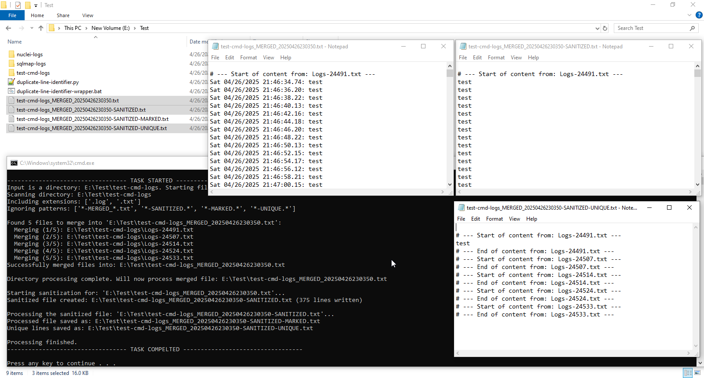
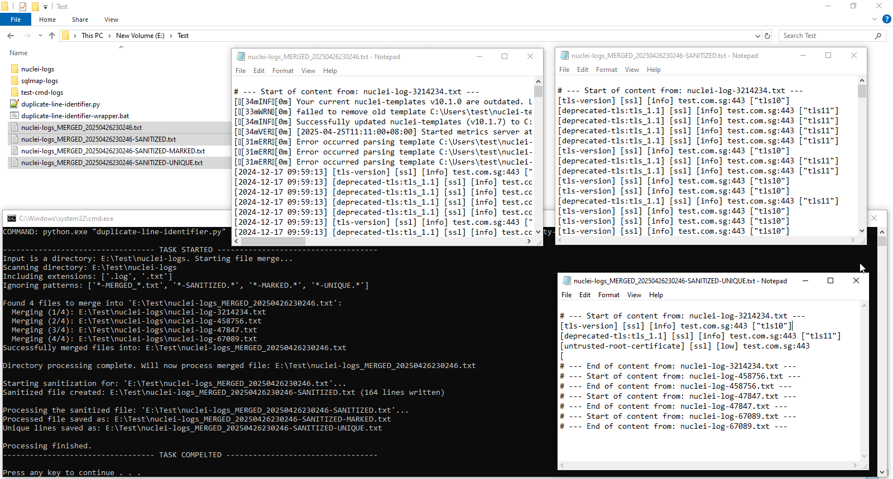

# Duplicate-Line-Identifier
[](https://opensource.org/licenses/MIT) A simple yet powerful Python script to identify and remove duplicate lines from text files. It can process a single file or recursively scan directories and subdirectories. Includes features to ignore patterns (like timestamps) using regular expressions before comparison, making it highly effective for cleaning up log files or aggregated tool outputs.

## Demo


## Features

* Processes single text files or entire directories recursively.
* Identifies and removes exact duplicate lines.
* Creates new files with unique lines in a seperate file, preserving the original file structure.
* Keeps the first occurrence of a unique line and discards subsequent duplicates.

## Installation

1.  **Clone the repository:**
    ```bash
    git clone https://github.com/V9Y1nf0S3C/Duplicate-Line-Identifier.git
    ```
2.  **Navigate to the directory:**
    ```bash
    cd Duplicate-Line-Identifier
    ```

## Usage

The script is run from the command line.

```bash
python duplicate-line-identifier.py "E:\test\test-cmd-logs"  --disable-line-number --disable-tags --keep-empty-duplicates
````

## Screenshots

**Input File/Directory Structure:**
<kbd></kbd>  
**Fig-1:** Working with custom timestamps.
<br>
<br>
<kbd></kbd>  
**Fig-2:** Working with nuclei outputs.
<br>
<br>

